# 👋 Welcome to ELPEEF

  

**ELPEEF** — *Lembaga Pengembangan Framework*  
> **KOLABORAKSI**: Kolaborasi nyata, aksi nyata 🚀

We are a team of educators, developers, and researchers focused on building **open, collaborative systems** powered by **Web3 technologies** for the **education, tourism, and local community** sectors.  

---

# 🎓 GitHub Education Program Integration

This organization, **ELPEEF**, is part of the GitHub Education ecosystem.  
We leverage the benefits of GitHub Education to create **open, decentralized, and collaborative tools** for public use.  

> 💡 Supporting innovation in tourism, education, and Web3

---

## 📘 Why GitHub Education? 

GitHub Education provides us with: 

- ✅ Unlimited private repositories for academic projects
- ✅ Access to GitHub Actions, Codespaces, and advanced CI/CD pipelines
- ✅ Developer tools such as JetBrains IDE, Canva Pro, and domain support via Namecheap These benefits empower our students and collaborators to build real-world solutions while learning best practices in open-source development.

> “Education is not the learning of facts, but the training of the mind to think.” – *Albert Einstein*

---

## 📦 Featured Repository 

### [smarttourismchain](https://github.com/ELPEEF/smarttourismchain) 

Smart contract implementation for decentralized tourism booking using Solidity and adapted to local use cases with interoperability in mind.

You can find the live simulation in the official [website](https://smartourism.elpeef.com/)

---

## 🧩 STC Ecosystem & ☂ RANTAI Communities

---

## 📊 How We Work

```mermaid
flowchart TD
  A["Idea 💡"] --> B["Collaborate 🤝"]
  B --> C["Build 🔨"]
  C --> D["Test & Learn 📚"]
  D --> E["Deploy 🚀"]
  E --> F["Share & Educate 🌍"]
```

## ☎ Contact Us

- 🌐 <a href="https://elpeef.com">Website</a>

- 📫 <a href="mailto:webmaster@elpeef.com">Email</a>

-  <a href="https://github.com/mrbrightsides">mrbrightsides</a>

-  Based in Indonesia

---

## 🙌 Want to Collaborate?

- Join our mission on GitHub
- Use our tools and give feedback
- Or fork our repos and build your own innovation!

> **Together, we code. Together, we educate. Together, we build the future.**

:octocat: Built with ❤️ by the ELPEEF Team
